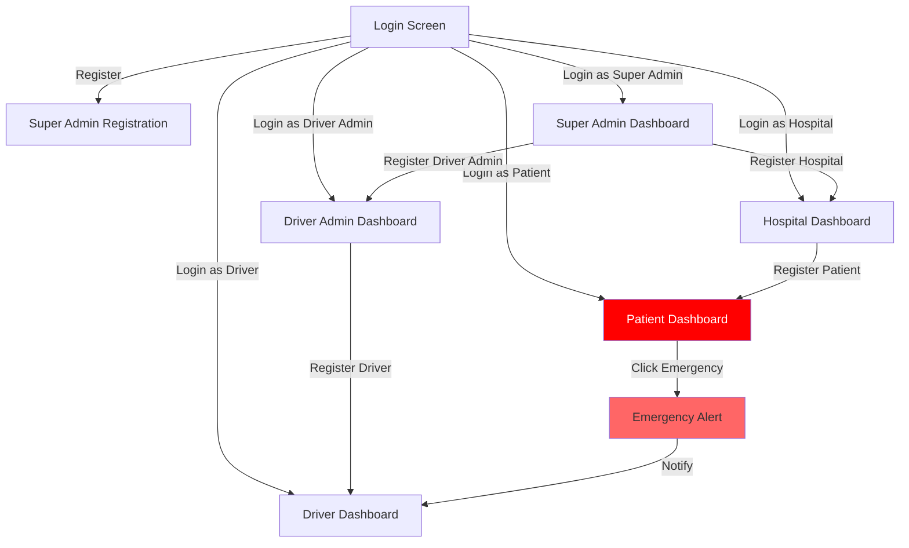

# ✅ MamaAlert App Layout - Complete

## Your Exact Requirements → Implementation Status

| Requirement | Status | File |
|-------------|--------|------|
| **Login screen as default** | ✅ Implemented | `main.dart`, `login_screen.dart` |
| **Navigate to Register Super Admin** | ✅ Implemented | `login_screen.dart` (button added) |
| **Super Admin: Register Hospital button** | ✅ Implemented | `super_admin_dashboard.dart` |
| **Super Admin: Register Driver Admin button** | ✅ Implemented | `super_admin_dashboard.dart` |
| **Hospital: Register Patient button** | ✅ Implemented | `hospital_dashboard.dart` |
| **Driver Admin: Register Driver button** | ✅ Implemented | `driver_admin_dashboard.dart` |
| **Patient: BIG RED Emergency button** | ✅ Implemented | `patient_dashboard.dart` |
| **Driver: View alerts** | ✅ Implemented | `driver_dashboard.dart` |

---

## 🎯 Dashboard Quick Reference

### 1. Login Screen
```
┌────────────────────────────┐
│      🤰 MamaAlert          │
│                            │
│   Email: [________]        │
│   Password: [________]     │
│                            │
│      [  LOGIN  ]           │
│                            │
│   ─────────────────        │
│   First time setup?        │
│ [ Register as Super Admin ]│
│                            │
└────────────────────────────┘
```

### 2. Super Admin Dashboard
```
┌────────────────────────────┐
│  Super Admin Dashboard  🚪│
│                            │
│    👑 Super Administrator  │
│                            │
│  ┌──────────────────────┐  │
│  │ 🏥 Register Hospital │  │
│  └──────────────────────┘  │
│                            │
│  ┌──────────────────────┐  │
│  │ 🏢 Register Driver   │  │
│  │      Admin           │  │
│  └──────────────────────┘  │
│                            │
└────────────────────────────┘
```

### 3. Hospital Dashboard
```
┌────────────────────────────┐
│   Hospital Dashboard    🚪│
│                            │
│      🏥 Hospital Portal    │
│                            │
│  ┌──────────────────────┐  │
│  │ 🤰 Register Patient  │  │
│  └──────────────────────┘  │
│                            │
└────────────────────────────┘
```

### 4. Driver Admin Dashboard
```
┌────────────────────────────┐
│ Driver Admin Dashboard  🚪│
│                            │
│    🏢 Driver Admin Portal  │
│                            │
│  ┌──────────────────────┐  │
│  │ 🚕 Register Driver   │  │
│  └──────────────────────┘  │
│                            │
└────────────────────────────┘
```

### 5. Patient Dashboard
```
┌────────────────────────────┐
│  MamaAlert - Patient    🚪│
│                            │
│        🚨 Emergency        │
│                            │
│  ┌──────────────────────┐  │
│  │                      │  │
│  │   🚨 EMERGENCY 🚨    │  │
│  │                      │  │
│  │    Tap for Help      │  │
│  │                      │  │
│  └──────────────────────┘  │
│         (BIG RED)          │
│                            │
└────────────────────────────┘
```

### 6. Driver Dashboard
```
┌────────────────────────────┐
│   Driver Dashboard      🚪│
│                            │
│      🚕 Driver Portal      │
│                            │
│  ┌──────────────────────┐  │
│  │  ✅ You are available│  │
│  └──────────────────────┘  │
│                            │
│ [ View Emergency Alerts ]  │
│                            │
└────────────────────────────┘
```

---

## 📱 Screen-by-Screen Button List

### Login Screen
- ✅ **Login** button (main action)
- ✅ **Register as Super Admin** button (outlined style)

### Super Admin Dashboard
- ✅ **Register Hospital** button (card with arrow)
- ✅ **Register Driver Admin** button (card with arrow)
- ✅ **Logout** button (AppBar)

### Hospital Dashboard
- ✅ **Register Patient** button (card with arrow)
- ✅ **Logout** button (AppBar)

### Driver Admin Dashboard
- ✅ **Register Driver** button (card with arrow)
- ✅ **Logout** button (AppBar)

### Patient Dashboard
- ✅ **EMERGENCY** button (200px tall, RED, centered)
- ✅ **Logout** button (AppBar)

### Driver Dashboard
- ✅ **View Emergency Alerts** button
- ✅ **Logout** button (AppBar)

---

## 🎨 Visual Design Features

### Patient Emergency Button
- **Size**: 200px height (LARGE!)
- **Color**: Bright RED (#FF0000)
- **Icon**: Emergency share icon (80px)
- **Text**: 
  - "EMERGENCY" (36px, bold)
  - "Tap for Help" (18px)
- **Effect**: Elevated shadow (elevation: 8)
- **Shape**: Rounded corners (20px radius)

### Action Cards (Registration Buttons)
- **Layout**: Row with icon, text, and arrow
- **Icon Container**: 60x60px with colored background
- **Elevation**: 4 (subtle shadow)
- **Hover**: InkWell ripple effect
- **Arrow**: Right-facing chevron

---

## 🔄 Complete User Flow



---

## ✨ Key Implementation Highlights

1. **Login Screen Enhanced**:
   - Clear "First time setup?" heading
   - Prominent "Register as Super Admin" button
   - Explanatory text: "Other users will be registered by their respective admins"

2. **All Dashboards Have**:
   - Role-specific icon and title
   - Color-coded theme
   - Logout button in AppBar
   - Descriptive subtitle

3. **Patient Dashboard Special**:
   - Entire screen centered around BIG RED button
   - Minimal distractions
   - Emergency-focused design
   - Warning/info box about notification

4. **Consistent Navigation**:
   - All registration buttons use Card + InkWell
   - All use MaterialPageRoute for navigation
   - All return to Login on logout

---

## 📝 Testing Checklist

- [ ] Open app → See Login screen
- [ ] Click "Register as Super Admin" → Opens registration form
- [ ] Login as Super Admin → See 2 buttons (Hospital, Driver Admin)
- [ ] Login as Hospital → See 1 button (Register Patient)
- [ ] Login as Driver Admin → See 1 button (Register Driver)
- [ ] Login as Patient → See BIG RED EMERGENCY button
- [ ] Login as Driver → See "View Emergency Alerts" button
- [ ] All Logout buttons → Return to Login screen

---

**Your app layout is exactly as requested!** 🎉

The implementation is clean, simple, and follows your specification:
- Login is default ✅
- Navigation to Super Admin registration ✅
- Role-specific registration buttons ✅
- Patient has red emergency button ✅
- Driver Admin has register driver button ✅
